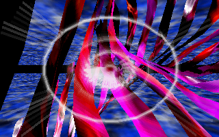

# ixalance-js

The Black Lotus' **iXalance** demo loader, ported to the browser.

iXalance was a small Win32 host TBL wrote in February 1998 so their DOS demos would keep
running after DOS. It did not rewrite them: it read the original protected-mode executable
out of an `.IXA` file, relocated it, and jumped in. This project does the same thing in
JavaScript, executing the 1997 binaries instruction by instruction.





Those frames came out of the interpreter, not a video capture.

## Running it

```
npm run serve      # or: python3 -m http.server 8731 --bind 127.0.0.1
```

Then open <http://127.0.0.1:8731/>. It has to be served over HTTP — the page uses ES
modules, a module worker and `fetch`, none of which work from a `file://` URL.

There is no build step and no dependencies.

**Jizz spends its first ~2.5 billion instructions generating its graphics** and shows a
decrunch bar while it does. That is the intro working as designed, not the page hanging.
Give it a minute or two.

## Why it cannot just be compiled

`startdemo` in iXalance's `code.asm` ends with `call far [runexe]` — it jumps into x86
machine code. The payload *is* x86, so Emscripten would produce the loader's shell and
nothing that runs inside it.

What makes the port tractable is that iXalance already did the hard decoupling in 1998.
Under it the demos never touch DOS, the BIOS, VGA registers, interrupts or I/O ports. The
entire interface is one struct and nine function pointers. So this needs a CPU and almost
nothing else — not a PC emulator.

## Layout

| File | Role |
|------|------|
| `lib/ixa.js` | `.IXA` container, LZSS and RLE codecs, script bytecode |
| `lib/d32.js` | DOS/32A header parse and relocation |
| `lib/machine.js` | flat address space, `gfxmodeinfo`, callback trampolines, the `startdemo` stack frame |
| `lib/cpu.js` | 386 integer interpreter |
| `lib/jit.js` | hot-block JavaScript compiler, with the interpreter as fallback and oracle |
| `lib/fpu.js` | x87 core |
| `lib/xm.js` | FastTracker II replayer, free of Web Audio so it also runs in Node |
| `worker.js` | runs the CPU off the main thread, posts frames as RGBA |
| `audio.js` | builds the AudioWorklet, relays music position back to the worker |
| `index.html` | front end: canvas, log, controls |
| `run.mjs` | headless harness — verification, frame dumps, module dumps, WAV rendering |
| `data/` | the three `.IXA` files, plus reference digests |

Threading matters here. The CPU runs in a **worker**, because a slice large enough
to make progress blocks for hundreds of milliseconds and would read as a hung tab. The XM
replayer runs in an **AudioWorklet**, on the audio thread, because the interpreter is
slower than real time in places and music that stalled whenever the emulation did would be
worse than silence.

That gives two clock modes, exposed as the page's sound toggle:

* **sound on** — real-time clock, position reported by the audio thread. The demo follows
  the music and the visuals skip where the interpreter cannot keep up. This is what the
  original did, since it asked MIDAS where the module had got to.
* **sound off** — virtual clock, advanced per presented frame. Smooth but silent.

## Status

**Jizz and Stash play, with music.** Both are single-part 64K intros.

**Astral Blur does not run yet.** It is a 20-block demo needing the script interpreter to
drive `PushExe`/`PopPart`/`PushPicture` across 15 executable parts, three pictures and a
stored module, with four `waitmusic` synchronisation points. Only the single-block path is
implemented, so the dropdown entry will not get far.

The browser uses the block JIT by default. Hot decoded x86 blocks become straight-line
JavaScript while uncommon instructions fall back to the interpreter. Jizz also generates
specialized rasterizer code at runtime; once one of those blocks starts patching only its
constants, the JIT keeps a shape-checked function and reads the current immediates instead
of recompiling it or abandoning it to the interpreter. On the development
machine, a 1.5-billion-instruction Jizz run sustains roughly 130 million instructions per
second versus 48 million in the interpreter; browser and hardware results vary. Uncheck
**JIT**, use `?engine=cpu`, or set `IXA_ENGINE=cpu` in Node to run the reference engine.

**Pixel accuracy is unverified.** The output is coherent and clearly right in character,
but nothing has been diffed against a reference capture, so an x87 rounding difference or
a mis-set flag would not have been caught.

### Verifying

```
npm run verify
```

Unpacks every block of all three bundled modules and compares against known-good digests
in `data/reference.json`. Those came from `unixa.py` in the
[demoscene-archeology](../demoscene-archeology/tbl) repository, where the format was
reverse-engineered and documented; its correctness rests on the container being
self-verifying — blocks are contiguous and end exactly at EOF, the LZSS output length
matches the length the RLE stage declares, and the RLE output matches the directory's
recorded size.

Other headless tools:

```
node run.mjs run data/jizz.ixa                          # execute, report where it stops
node run.mjs run data/jizz.ixa 1 20000000000 out/frames # dump frames as PNG
node run.mjs dumpxm data/jizz.ixa out/jizz.xm           # capture the generated module
node run.mjs renderxm out/jizz.xm out/jizz.wav 30       # render audio to WAV
```

`IXA_FRAME_FROM`, `IXA_FRAME_EVERY`, `IXA_CLOCK` and `IXA_ENGINE` tune frame dumping,
clock source and CPU engine. Jizz reaches its first real effect around frame 1200.

### Benchmarking by XM phase

Jizz and Stash change workload completely between generation, decrunching and their
individual effects, so a whole-program instruction rate hides the sections that actually
miss frames. The order benchmark stops immediately after the intro hands its generated XM
to `TBL1` (the end of Jizz's decrunch/startup phase), saves the complete architectural state
and live memory, then uses that checkpoint for subsequent runs:

```
npm run bench:jizz -- --prepare
npm run bench:jizz -- --phase decrunch --engine jit --repeat 3
npm run bench:jizz -- --engine both --from 0 --to 2 --repeat 3
npm run bench:jizz -- --engine jit --orders 3,8,10-12 --repeat 3
npm run bench:jizz -- --engine both --orders 0-21 --csv out/bench/jizz-orders.csv
npm run bench:jizz -- --prepare-order 12
npm run bench:stash -- --engine jit --from 4 --to 6
npm run bench:stash -- --music 1 --row-step 16 --engine jit --csv out/bench/stash-xm1-rows.csv
npm run bench:stash -- --music 2 --row-step 32 --engine jit --csv out/bench/stash-xm2-rows.csv
npm run bench:stash -- --music 1 --orders 0 --row-step 16 --rows 16
```

`--phase decrunch` measures only a fresh machine's startup through the completed `TBL1`
instruction. `--from` is inclusive and `--to` exclusive. A later range automatically loads
an exact order-start snapshot; if it is missing, the JIT advances once from the nearest
earlier snapshot and caches every boundary it crosses. `--orders` accepts comma-separated
orders and inclusive ranges, and runs every selected order independently from its own cold
snapshot, so work in the gaps is neither timed nor executed repeatedly. `--budget` applies
separately to each isolated order.

Stash hands two generated XMs to `TBL1`; `--music N` selects them using a one-based index.
`--row-step N` divides each selected order into independently restorable row windows, and
`--rows` can focus the run on particular window starts. Pattern breaks and jumps shorten
the last window instead of creating unreachable snapshots. This matters for Stash: its
first XM normally uses speed 24 and is profiled in 16-row windows, while its second XM
starts at speed 12 and is profiled in 32-row windows.

`--csv FILE` writes phase timings and rates together with JIT speedup, performance
rank, absolute MIPS deficit from the fastest selected order, and percentage of that fastest
rate. Use `IXA_JIT_STATS=1` on a focused JIT run to print exact uncovered forms (including
x87 raw bytes and ModRM `/reg` forms) after the performance sweep identifies an outlier.

The measured Jizz follow-up backlog and the Chrome/Safari regression from broad x87
inlining are recorded in [JIZZ_OPTIMIZATION_NOTES.md](JIZZ_OPTIMIZATION_NOTES.md).

The real XM replayer supplies order/row timing, including tempo changes, pattern breaks,
jumps and loops, but skips sample mixing because browser audio runs on a separate thread.

Checkpoints live under `out/bench/`, include CPU, FPU, machine and memory state, and never
include decoder or JIT caches. Consequently every restored engine starts cold. The first
benchmark creates a missing post-decrunch checkpoint automatically. `--prepare-order N`
materializes reusable order starts through `N` without timing an order window. `--rebuild`
regenerates the post-decrunch state after a startup-path change and ignores dependent order
caches for that invocation; stale dependent snapshots are also rejected whenever their base
state differs. `--rebuild --prepare` rebuilds only the base snapshot without running any
order windows. Row-window snapshots use `(music, order, row)` identity, so the two Stash
soundtracks cannot collide even when they share order and row numbers.

## Fidelity notes

The x87 stack is held as JS doubles, not 80-bit extended, so intermediates the real FPU
keeps at a 64-bit mantissa are rounded to 53 bits. That should be invisible for this code,
but it is the first thing to suspect if geometry ever drifts. Rounding mode for
`fist`/`fistp` does honour the control word's RC field, because demos switch it to truncate
and that changes results visibly.

Segment registers are stored and compared but never used for addressing, since every
selector has base 0 in the flat model these demos run under.

The replayer implements what TBL's modules actually use, which was measured by walking
their pattern and instrument data rather than guessed: linear frequency, 8-bit
delta-coded samples with none/forward/ping-pong loops, **no instrument envelopes at all**
(not one of the 256 instruments across the three modules enables one), a volume column
limited to set-volume and set-panning, and effects `0 1 2 3 4 8 9 A B C D F P` with
`E1 E2 E6 E8 E9 EA EB EC ED EE`. It reports anything it skipped rather than approximating
it; on these three modules that list is empty.

No MMX or SSE is implemented. None is needed: across 4.8 MB of demo code there is not one
MMX register load. The Pentium requirement in Stash's docs is asking for FPU throughput,
not new instructions.

## The data

`data/` holds the three `.IXA` files from
`files.scene.org/demos/groups/tbl/pc/`, unmodified.

| File | SHA-256 |
|------|---------|
| `jizz.ixa` | `5c55d364740911715e6ee50fafd1f4a2a88479ed853364b857b0711cb4a0685e` |
| `stash.ixa` | `87b326631d4ef9f4b4ba2c93c46dd73854666b6213d1c5074cb23f9f92bd9e21` |
| `astral.ixa` | `4f5326b36ba790bf439921e3d0a48c02e425d48bba617a541ef5be58be49b9fa` |

`stash.ixa` and `astral.ixa` are byte-identical to the copies the iXalance project page has
served since 2000, so both are corroborated across two independent distribution channels.
That page never carried a `jizz.ixa`, so that one rests on the scene.org copy alone.

Jizz and Stash do not ship music: they *generate* an XM at runtime and hand it to the host
— 940,876 and 899,710 bytes respectively, which is Probe's "950Kb of music into 20K" from
`JIZZ.DOC` showing up exactly as advertised.

## Licensing

Read this before publishing anything built from it.

**The port code derives from GPL-2 source.** The container layout, the LZSS and RLE
codecs, the DOS/32A relocation pass and the host ABI were all transcribed from
iXalance-1.0.5 by Jarno Paananen, which is GPL v2. This is a reimplementation in another
language rather than a copy, but it is a derivation, and the safe reading is that this
project is GPL-2 as well. That is a decision for the repository owner, which is why there
is no `LICENSE` file yet.

**The demo data is TBL's.** `STASH.DOC` states the terms plainly: copy and spread — yes;
for money — no; press on CD — yes; sell it — no; "modify one single bit" — no. Shipping
the `.IXA` files unmodified for non-commercial use is within that. Redistributing them
modified, or commercially, is not.

## Credits

* **The Black Lotus** — Jizz, Stash, Astral Blur, and iXalance itself. Code by Nix, Jace
  and Balance; music by Probe and Azazel; graphics by Danny, Sick Sjaak, Lowlife and Louie.
* **Jarno Paananen** (Sahara Surfers) — the iXalance/SDL port, whose source is what makes
  the format and ABI knowable at all. Still online at
  <https://www.libsdl.org/projects/ixalance/>.
* **Adam Seychell** — DOS/32A, the extender these binaries target.

Format archeology, the original extraction tooling and the provenance work live in the
[demoscene-archeology](../demoscene-archeology/tbl) repository.
